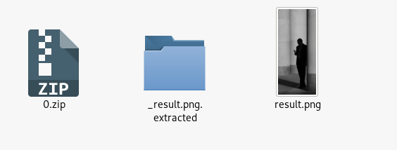
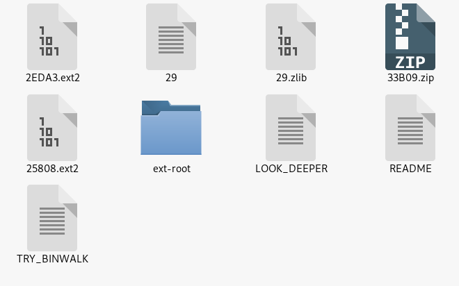
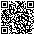

# CTF N26 Writeup 27 MAY [unsolved]

Found a challenge @ https://medium.com/insiden26/n26-security-3-0-81a4e85c5fe8
Downloaded a qr code as usual and parsed with CyberChef, normalized it has a link:

```
https://bit.ly/2UNkPAa
	http://0d6f52f4c5.s3-website.eu-central-1.amazonaws.com/
		https://gist.github.com/3l3v4t0r-ch1ck3n/97fd034ce88c2f879dc88e919be0e65c
```

There's an encoded base 64 string, time to decode.

In windows :

```
certutil -decode first_base64.txt decoded
```

Its a zip archive with a .png image inside, using binwalk i see it has a footer.

```bash
root@kali:~/Desktop/27MAY# binwalk -I decoded

DECIMAL       HEXADECIMAL     DESCRIPTION
--------------------------------------------------------------------------------
0             0x0             Zip archive data, at least v2.0 to extract, compressed size: 209501, uncompressed size: 212209, name: result.png
209649        0x332F1         End of Zip archive, footer length: 22
```

I just extract all, with a deep scan
```bash
binwalk -eIMD 32 decoded 
```
There are many files:





Using Stegsolve 1.3 on that image, Red, Blue,Green 6 have a hidden QR code



Inside this qr code there's this:

```
_t_p_:_/_i_t_g_t_u_._o_/_8_8_b_2_a_0_3_7_8_d_4_5_3_0_e_1
```

seems like a gist git url...

---

Going inside the structure of the directory i find the first flag inside the readme plus a link

### First flag:			 Flag1: FLAG1TyN2NGdPan

https://s3.eu-central-1.amazonaws.com/b0d6f52f4c5216fb15272/public

The link downloads a file "public" inside the file there's this string:

​	Am1RnerWXXhTibZydOPW9Th.


